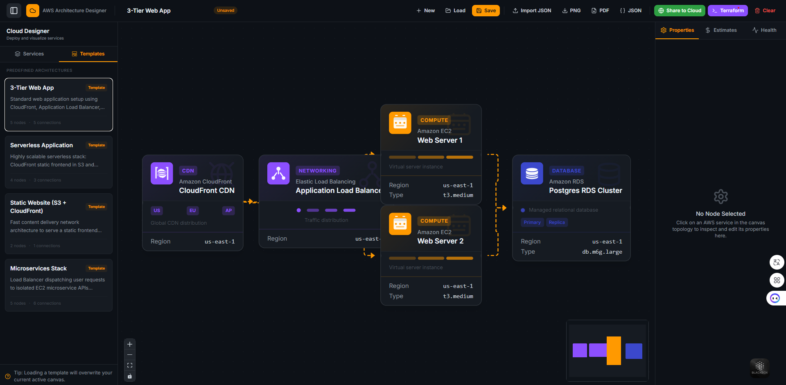

# AWS Cloud Architecture Platform Designer

A production-ready web application to design, validate, cost-estimate, and export AWS cloud architectures. Built with **Next.js**, **TypeScript**, **React Flow**, and **AWS SDK v3**.



👉 **Live Demo:** *[Paste your Vercel deploy link here]*

---

## 🚀 Key Features

* 📐 **Visual Topology Modeler** — Drag-and-drop AWS components (EC2, S3, RDS, Lambda, Application Load Balancer, CloudFront) and connect them with animated data-flow arrows.
* 🤖 **Architecture Validation & Health Engine** — Real-time infrastructure compliance auditing with a **0-100 Health Score** based on AWS best practices:
  * RDS databases must be linked to EC2 instances.
  * Load Balancers must route to EC2 compute targets.
  * CloudFront CDNs must target S3 origins or Application Load Balancers.
  * Auto-detects and flags isolated/orphaned resources.
* 💸 **Real-Time Cost Estimator** — Live monthly pricing estimates calculated automatically as you design, providing pre-sales and architectural cost clarity.
* 📝 **Terraform (IaC) Code Exporter** — Translates the visual diagram into structured HCL files (`main.tf`, `variables.tf`, `providers.tf`, `outputs.tf`) ready to run.
* ☁️ **S3 Cloud Share (AWS SDK v3)** — Base64 diagram capture and secure backend upload to Amazon S3, generating a public asset URL with quick copy actions and LinkedIn share badges.
* 🗂️ **Architectural Presets (Templates)** — Load pre-configured patterns instantly:
  * *3-Tier Web App* (CloudFront CDN ➔ ALB ➔ 2x EC2 App ➔ Postgres RDS)
  * *Serverless Stack* (CloudFront ➔ S3 Frontend & Lambda API ➔ Aurora RDS)
  * *Static Website* (CloudFront ➔ S3 Bucket)
  * *Microservices Stack* (ALB Gateway ➔ 3x EC2 APIs ➔ Shared DB)
* 💾 **Save & Load** — Save designs locally in the browser or export them as JSON configuration files.

---

## 🛠️ Tech Stack

* **Core Framework:** [Next.js 15](https://nextjs.org/) (App Router, Turbopack)
* **Diagram Graph Engine:** [React Flow (@xyflow/react)](https://reactflow.dev/)
* **AWS Integration:** [AWS SDK v3 S3 Client](https://github.com/aws/aws-sdk-js-v3)
* **Document Compilation:** [jsPDF](https://github.com/parallax/jsPDF) & [html-to-image](https://github.com/bubkoo/html-to-image)
* **Styling:** Vanilla TailwindCSS 4
* **Language:** TypeScript (Strict compliance)

---

## ⚙️ Setup & Deployment

### 1. Environment Configuration
Create a `.env.local` file at the root of the project using the template in `.env.example`:

```ini
AWS_ACCESS_KEY_ID=your_aws_access_key_id
AWS_SECRET_ACCESS_KEY=your_aws_secret_access_key
AWS_REGION=ap-northeast-1
AWS_S3_BUCKET_NAME=your_s3_bucket_name
```

### 2. Local Run
Install dependencies and launch the Turbopack server:

```bash
npm install
npm run dev
```

Open [http://localhost:3000](http://localhost:3000) to start designing.

### 3. Vercel Deployment
Deploy securely to Vercel by importing the GitHub repository and adding the four `AWS_*` environment keys under your Vercel Project Settings.
